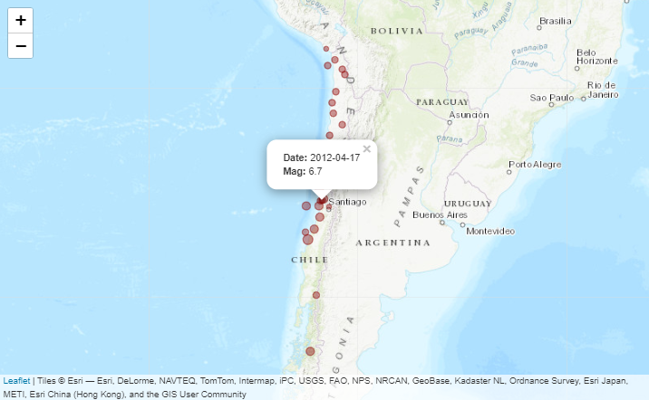
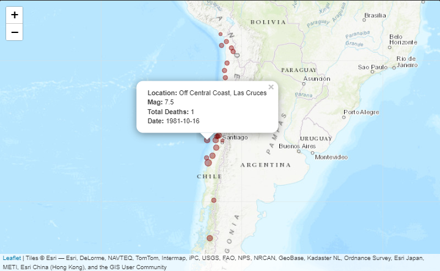

# quakr

------------------------------------------------------------------------

<!-- badges: start -->

[](https://github.com/Karrrramba/quakr/actions/workflows/R-CMD-check.yaml)
[](https://app.travis-ci.com/Karrrramba/quakr)

<!-- badges: end -->

This is my capstone project of the [Mastering Software Development in
R](https://www.coursera.org/specializations/r) specialization on
Coursera.

The Earthquake data was obtained from the [National Centers of
Environmental
Information](https://www.ncei.noaa.gov/access/metadata/landing-page/bin/iso?id=gov.noaa.ngdc.mgg.hazards:G012153)
(doi: 10.7289/V5TD9V7K).

The quakr package provides quality of life tools for analysis and
visualizations of earthquake data.

## Installation

------------------------------------------------------------------------

You can install the development version of quakr by executing the
following code:

``` r
remotes::install_github("Karrrramba/quakr")
```

### Overview

------------------------------------------------------------------------

``` r
library(quakr)
library(ggplot2)
library(dplyr)
# Load dataset
data("southamerica", package = "quakr")
```

Below you will find examples that illustrate the visualization features.
The package’s
[vignette](https://github.com/Karrrramba/quakr/blob/master/vignettes/quakr.Rmd)
shows more customization options for timelines and interactive maps.

``` r
southamerica %>% 
  filter(country %in% c("PERU", "CHILE") & lubridate::year(date) >= 2000) %>%
  ggplot(aes(x = date, y = country)) +
  # Plot a timeline of earthquake events
  geom_timeline(aes(xmin = min(date), xmax = max(date), 
                    size = mag, col = total_deaths)) +
  # Add labels 
  geom_timeline_label(aes(label = location),
                      fontsize = 2,
                      rot = 10,
                      check_overlap = TRUE,
                      label_dodge = TRUE) +
  theme_minimal() +
  labs(x = "Year",
       y = "",
       size = "Richter Scale Magnitude",
       col = "Total Deaths") +
  theme(legend.position = "bottom")
```


``` r
# This is only a snapshot of the resulting interactive plot.
southamerica %>% 
  filter(country == "CHILE" & lubridate::year(date) >= 2000) %>%
  mutate(label = eq_create_label(., defaults = FALSE, "date", "mag")) %>% 
  eq_map(annot_col = "label", scaling_factor = 5)
```




